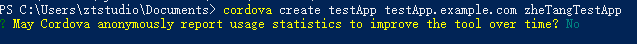
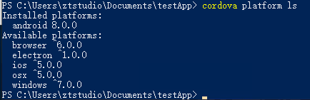
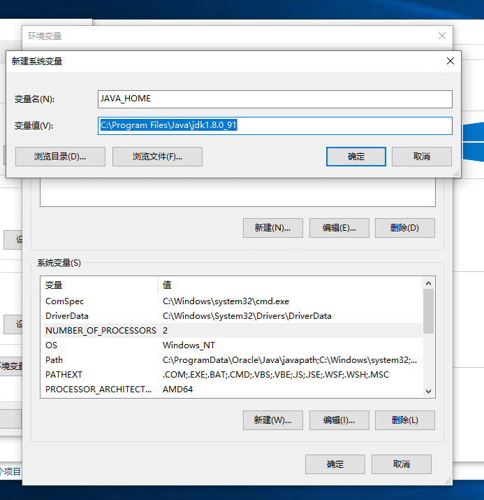
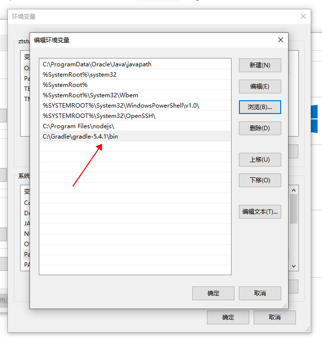
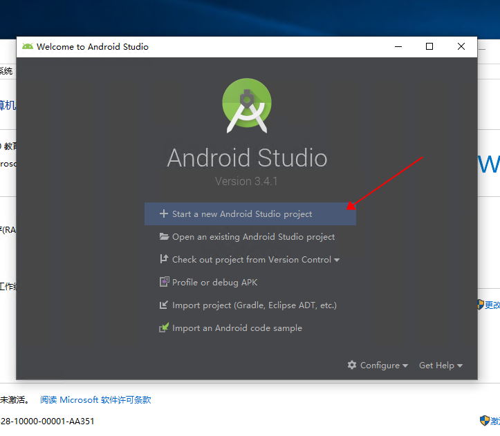
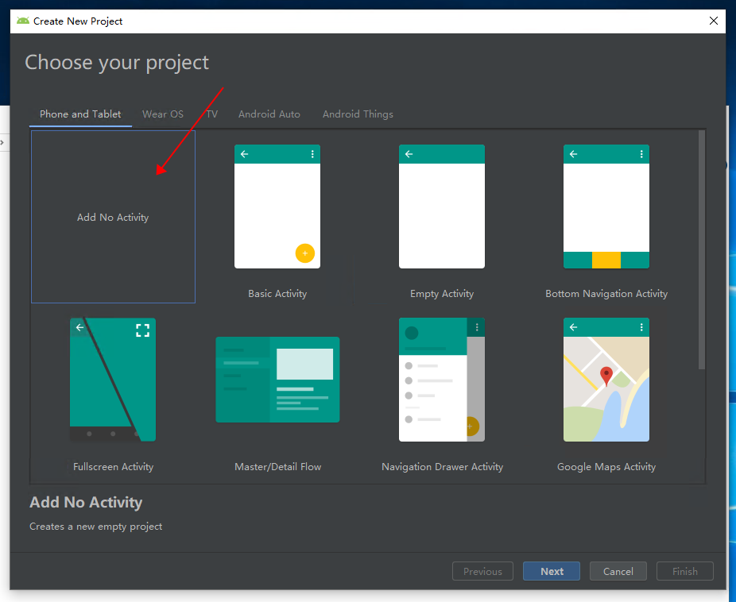
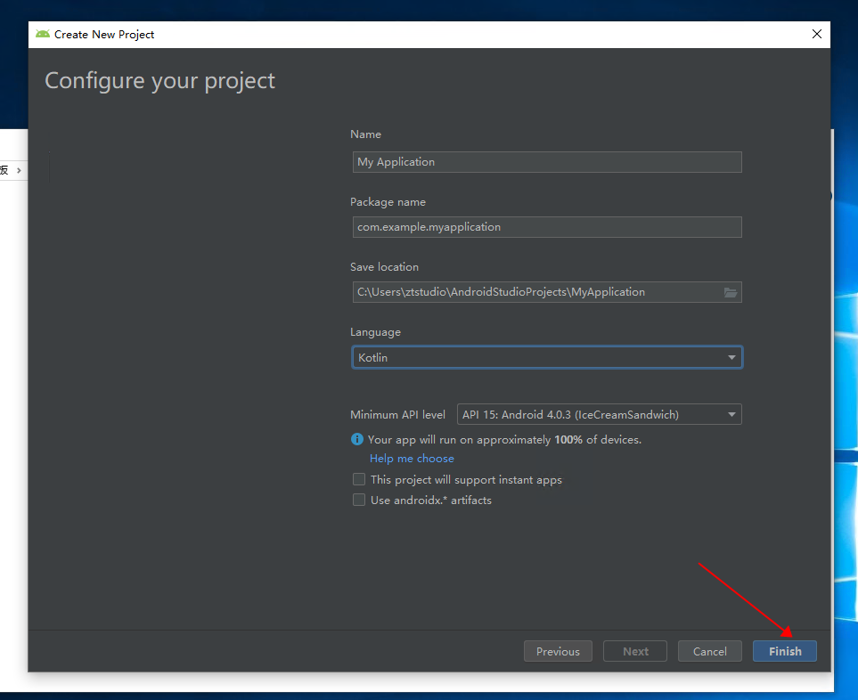
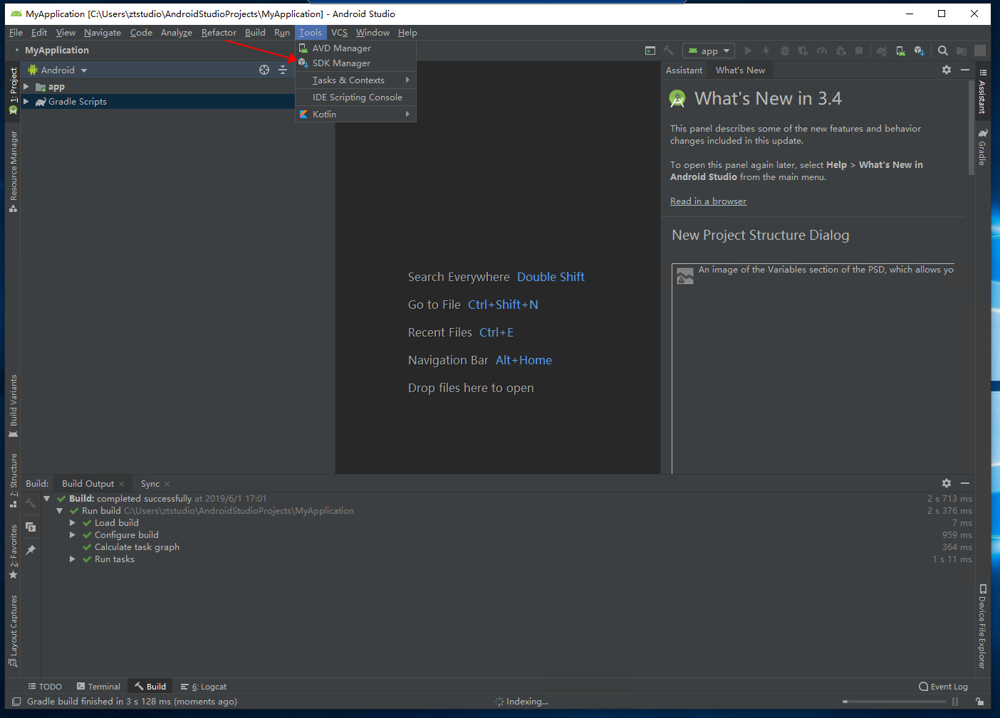
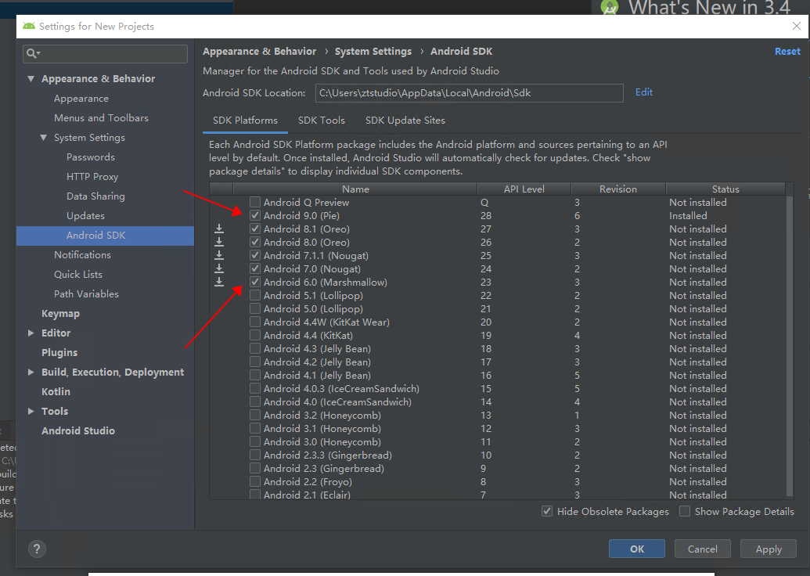

## 前置环境 nodeJS v10.16.0，node 版本最好不要低于 v8.0.0

## 安装 cordova

```shell
npm install -g cordova
# 若安装过慢，请使用淘宝镜像
npm install -g cordova --registry=https://registry.npm.taobao.org
```

## 创建新的 cordova 项目

```shell
# testApp为目录名path
# test.example.com为项目id
# testApp为项目名name
cordova create testApp test.example.com testApp
```



发送使用信息选 No

<!-- more -->

## 为项目加入 android 平台

```shell
# 进入刚刚新建的项目路径
cd testApp
# 增加android平台
cordova platform add android
# 查看已安装平台
cordova platform ls
```



## 安装 android 平台前置环境

1.安装 jdk8（jdk-8u91)，安装完成后配置环境变量



2.安装 gradle，解压 gradle.zip 到 C:\Gradle，然后将 gradle-5.4.1\bin 添加到环境变量



3.安装 android studio，安装好后新建项目如下图







4.等待所有配置自动安装下载完成后，打开 Tools，点击 SDK Manager 配置 android 版本，钩选 android6-android9 的版本，下载安装





至此，前置环境配置完成

所有前置环境安装完成后，就可以打包 App 了

## 前端文件的准备

1. 如果是原生的 js 文件，没有使用框架，可以直接放入 cordova 项目的 www 目录中，如 testApp 下的 www 文件夹
1. 如果使用了 vue 框架，则需要修改 router.js 中 mode 为 hash，vue.config.js 中 publicPath 为"./"，再进行打包，将打包后 dist 文件夹中的文件放入 www 文件目录中

## 打包

开始打包，cd 进入之前的 testApp 目录，执行打包

```shell
cd testApp
cordova build
```

等待命令行执行完成后，就可以在 testApp/platforms/android/app/build/outputs/debug/找到名为 app-debug.apk 的安装包文件了。

## 真机模拟

如果要在打包后直接模拟手机查看效果，则需要开启 BIOS 设置中的 Intel VT-x 虚拟选项。

```shell
# 不用执行cordova build，直接执行模拟器命令，即可在打包完后直接模拟手机。
cordova emulate android
```

## 修改 App 名称与图标

在 testApp 目录下修改 config.xml，name 为 App 名称，与新建项目 create 命令的 name 一致，默认没有 icon 标签，需自行添加，再使用正确的图片路径即可。

```xml
<name>testApp</name>
<icon src="./reverse.png" />
```
