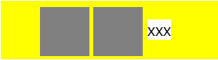

## 基础知识

### vertical-align 的使用范围

vertical-align 只能应用于 inline 元素，即 display 为 inline、inline-block、inline-table 的元素，img 与 span 都是 inline 元素

### 基线

图中的 baseline 即为元素的基线，x-height 就是 x 高度


由图可见**元素基线位置是由元素自身的字体大小与行高决定的**，还会受到子元素影响。

#### inline-table 的基线

以表格第一行的基线为基线

#### inline-block 的基线

1. 在有正常文档流内容或 overflow 属性计算值为 visible 以外的值的情况下，inline-block 元素的 baseline 就是最后一个 line-box 元素的 baseline；

2. 除上面两种情况外，baseline 是 margin-box 的下边界；

<!-- more -->

## vertical-align

vertical-align 属性默认取值为 baseline，即将当前 box 的基线与父级 box 的基线对齐。

### 常见现象

水平排列 li 时，li 下方总有一片空白


```html
<ul class="outer">
  <li class="inner"></li>
  <li class="inner"></li>
  <!-- 这里本应该直接使用文字"xxx"来说明基线关系（直接使用文字是匿名line-box），但是为了能够直观看到"xxx"的背景色，这里用inline-block的span来代替匿名的line-box -->
  <span class="x">xxx</span>
</ul>
<style type="text/css">
  .outer {
    background-color: yellow;
  }
  .inner {
    background-color: gray;
    display: inline-block;
    /* 用较大的宽高撑开父级元素，可以看出父元素baseline随子元素的改变 */
    width: 50px;
    height: 50px;
  }
  .x {
    background-color: white;
  }
</style>
```

#### 形成原因

1. li 元素为 inline-block 元素，根据 inline-block 元素基线判断原则，li 内无内容、overflow 属性不为 visible，所以 li 的基线位置为底部

2. li 元素较大，撑开了 ul 元素，根据 vertical-align 默认值 baseline，li 基线与父级 ul 基线对齐，则 ul 元素基线位置被迫下移与 li 平齐

3. ul 中文字为匿名 line-box，有默认的行高，文字基线到底线的距离，形成了 li 下方的空白区域

#### 解决方法

理解了这种情况的形成原因，我们就知道了如何解决这种情况，两种方法：一种是将基线上移，另一种是将行高减小

1. 基线上移：li 元素 vertical-align 设为非 bottom 的值；

2. 行高缩小：ul 元素 line-height 设为 0，或 font-size 设为 0；

```css
/* 方法1 */
.inner {
  vertical-align: middle;
}
/* 方法2 */
.outer {
  line-height: 0;
  /* 或 */
  font-size: 0;
}
```

缩小行高的方法不推荐使用，因为在父级中设置会影响子元素。

特别提醒，其实还可以用 inline-flex 来彻底解决这个问题。

### 问题延伸 1

当 ul 高度与行高相等时，li 设置 vertical-align 为 middle，为什么 li 不是完全垂直居中的？



```html
<ul class="outer">
  <li class="inner"></li>
  <li class="inner"></li>
  <span class="x">xxx</span>
</ul>
<style type="text/css">
  .outer {
    background-color: yellow;
    height: 60px;
    line-height: 60px;
  }
  .inner {
    background-color: gray;
    display: inline-block;
    width: 50px;
    height: 50px;
    vertical-align: middle;
  }
  .x {
    background-color: white;
  }
</style>
```

#### 形成原因

1. 当行高与高度相同时，文字会居中，父元素基线位置在居中的文字底部

2. li 的 vertical-align 设置为 middle 时，li 的中点位置并不是直接与父元素 ul 的中点位置对齐的，而是相对于 ul 基线位置再加半个 x 的高度位置对齐的（通常这个位置略低于中点位置），因此就会发生不是完全居中对齐的情况

#### 解决方法

1. 设置父元素 font-size 为 0，由于不存在文字高度了，使得父元素基线与中点位置重合了，子元素中点对齐父元素基线+半 x 高度时，半 x 高度也为 0，则子元素直接对齐父元素基线，就达到了完全居中的效果。但是我们并不推荐此方法，会导致子元素中的字都消失

2. 使用辅助兄弟元素。先取消父元素的 line-height 设置，以使父元素基线位置不被固定，再设置一个宽为 0，高 100%的兄弟元素，并设置 display 为 inline-block，vertical-align 设为 middle，即可将父元素的基线位置变至辅助元素的中点，这样要居中的子元素设置 vertical-align 为 middle 后就可以正确垂直居中了

```html
<ul class="outer">
  <li class="inner"></li>
  <li class="inner"></li>
  <li class="helper"></li>
  <span class="x">xxx</span>
</ul>
<style>
  .outer {
    background-color: yellow;
    height: 60px;
  }
  .inner {
    background-color: gray;
    display: inline-block;
    width: 50px;
    height: 50px;
    vertical-align: middle;
  }
  .helper {
    display: inline-block;
    height: 100%;
    vertical-align: middle;
  }
  .x {
    background-color: white;
  }
</style>
```

### 问题延伸 2

li 中有文字时


```html
<ul class="outer">
  <li class="inner"></li>
  <li class="inner">x</li>
  <span class="x">xxx</span>
</ul>
<style type="text/css">
  .outer {
    background-color: yellow;
  }
  .inner {
    background-color: gray;
    display: inline-block;
    width: 50px;
    height: 50px;
  }
  .x {
    background-color: white;
  }
</style>
```

#### 形成原因

1. li 元素为 inline-block 元素，根据 inline-block 元素基线判断原则，第二个 li 有内容，所以 li 的基线位置为最后一个 line-box 的基线，x 字母为一个匿名 line-box，它的基线为 x 的底部，该 li 元素有且只有一个 line-box 字母 x，所以第二个 li 元素基线位置就是字母 x 的基线位置

2. 第一个 li 元素基线仍为底部，第二个 li 元素基线为其中字母 x 基线，它们都与父元素 ul 基线对齐，那么两个 li 元素基线也是对齐的，则第二个 li 元素下移，将父元素 ul 撑得更大

#### 解决方法

1. 改变 li 元素对齐方式，不再与父元素基线对齐

2. 为第二个 li 元素增加 overflow 不为 visible 的值

```html
<!-- 方法二 -->
<!-- 增加overflow属性后li基线位置重新变为li底部 -->
<li class="inner" style="overflow: auto">x</li>
<style>
  /* 方法一 */
  .inner {
    vertical-align: middle;
  }
</style>
```

### 问题延伸 3

父元素 font-size 为 0 时，一个 li 中为空，一个 li 中有字符，为什么第二个 li 上边界与第一个 li 下边界对齐？


```html
<ul class="outer">
  <li class="inner"></li>
  <li class="inner">x</li>
</ul>
<style type="text/css">
  .outer {
    background-color: yellow;
    font-size: 0;
  }
  .inner {
    background-color: gray;
    display: inline-block;
    width: 50px;
    height: 50px;
  }
</style>
```

#### 形成原因

1. 根据 inline-block 基线原则，第一个 li 内无内容且 overflow 不为 visible，其基线位置为 li 底边界，第二个 li 内有内容，其基线位置为字母 x 基线，第一个 li 底边与第二个 li 中字母 x 基线对齐

2. 当 font-size 为 0 时，字符高度为 0，字母 x 基线位置与第二个 li 顶边界重合，就造成了第一个 li 底边界与第二个 li 顶边界对齐的情况

### 问题延伸 4

父元素 line-height 为 0 时，一个 li 中为空，一个 li 中有字符，为什么第二个 li 背景下移了？


```html
<ul class="outer">
  <li class="inner"></li>
  <li class="inner">x</li>
</ul>
<style type="text/css">
  .outer {
    background-color: yellow;
    line-height: 0;
  }
  .inner {
    background-color: gray;
    display: inline-block;
    width: 50px;
    height: 50px;
  }
</style>
```

#### 形成原因

1. 两个 li 的基线情况同上例中一样，第一个 li 底边界为基线，第二个 li 字母 x 基线为 li 基线。

2. 字符占据高度由行高决定，li 继承了父元素行高为 0，那么字符占据高度也为 0，此时 li 的上边界就处于字符内容区域的顶部，降低到了字符内容区域的垂直中点上，这就造成了第二个 li 背景下移了。（注意这里不是 font-size 为 0，虽然字符占据高度为 0 了，但字符还是可见的，字符内容区域 content area 高度没有改变，若 font-size 为 0 字符就不可见了，内容区域高度也为 0 了）

## 总结

1. 元素基线位置是由元素自身的字体大小与行高决定的，还会受到子元素影响

2. inline-block 元素在有正常文档流内容或 overflow 属性计算值为 visible 以外的值的情况下，baseline 就是最后一个 line-box 元素的 baseline，否则 baseline 是 margin-box 的下边界（line-box、margin-box 是 css 各种盒模型的术语）

3. vertical-align 值为 middle 时，当前 box 的中点位置并不是直接与父级 box 的中点位置对齐的，而是相对于父级 box 的(基线位置 + (x 高度 / 2)) 位置对齐的（通常这个位置略低于中点位置）

4. font-size 为 0 时，字符内容区域高度为 0，字符占据高度为 0，由于 x 高度为 0，vertical-align: middle 直接对齐父级 box 基线；line-height 为 0 时，字符内容区域高度不变，字符占据高度为 0，当前 box 上边界由字符内容区域上边界下移至字符内容区域垂直中点

> 参考链接  
> [你可能不知道的 vertical-align](https://zhuanlan.zhihu.com/p/52441893)  
> [W3C Draft](https://drafts.csswg.org/css2/visudet.html#propdef-vertical-align)  
> [CSS 深入理解 vertical-align 和 line-height 的基友关系](https://www.zhangxinxu.com/wordpress/2015/08/css-deep-understand-vertical-align-and-line-height/comment-page-1/)  
> [Vertical-Align: All You Need To Know (CSS)](https://christopheraue.net/design/vertical-align)
