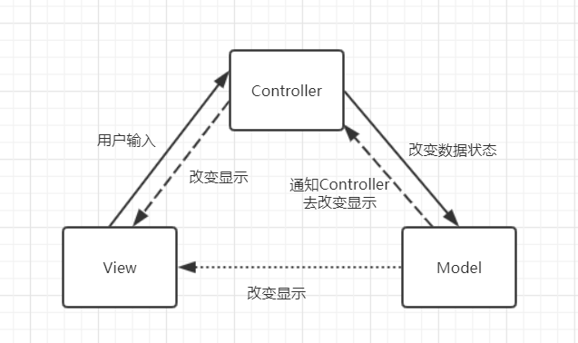
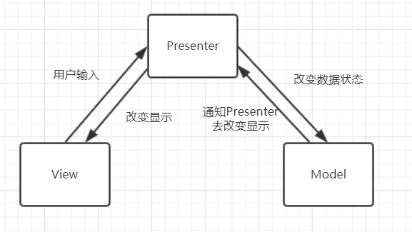
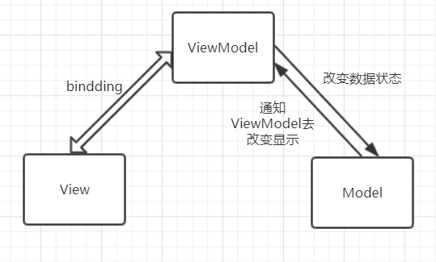

复杂的软件一定要有架构设计，好的架构模式使得软件更易于维护与扩展。架构模式（architectural pattern），属于编程方法论。

## MVC 模式

MVC 是 View-Model-Controller 的缩写，该架构模式是指将软件系统分为三个基本部分：

- 模型（Model）：用于封装与应用程序业务逻辑相关的数据以及对数据的处理方法。Model 有对数据直接访问的权力，例如对数据库的访问。Model 不依赖 View 和 Controller，也就是说 Model 不关心它会被如何显示或如何被操作。但是 Model 中数据的变化一般会通过一种刷新机制被公布。为了实现这种机制，那些用于监视此 Model 的 View 必须事先在此 Model 上注册，从而使 View 可以了解在数据 Model 上发生的改变。（如：软件设计模式中的观察者模式）

- 视图（View）：能够实现数据有目的地显示。在 View 中一般没有程序上的逻辑。为了实现 View 上的刷新功能，View 需要访问它监视的数据模型（Model），因此应该事先在被它监视的数据那时注册。

- 控制器（Controller）：起到不同层面间的组织作用，用于控制应用程序的流程。它处理事件并作出响应。“事件”包括用户的行为和数据 Model 上的改变。

<!-- more -->

### MVC 的通信方式

1. 用户通过在 View 上点击、输入等事件，传输指令到 Controller。

2. Controller 依据定义好的业务逻辑，要求 Model 改变状态。

3. Model 将更新后的数据发送到 View，用户看到数据的变化(还有一种常见的情况是 Model 不直接与 View 交互，而是通知 Controller 去改变 View)。

## MVP 模式

MVP 是 Model-View-Presenter 的缩写，是由 MVC 模式演变而来，MVP 中将 MVC 的 Controller 变为 Presenter。

MVP 与 MVC 的区别：

1. 通过 Presenter 对 Model 与 View 进行隔离。

2. View 与 Presenter、Presenter 与 Model 之间的通信是双向的。

3. View 层变得非常薄，不再部署业务逻辑，所有业务逻辑都增加到了 Presenter 层。

### MVP 的通信方式

1. 当 View 接收到用户事件时，会将事件转交给 Presenter 处理。

2. Presenter 操作 Model 改变数据状态。

3. Model 完成数据状态改变后通知 Presenter 改变 View

4. Presenter 通过 View 向外界暴露接口更新视图内容。

## MVVM 模式

MVVM 是 Model-View-ViewModel 的缩写。是 MVP 模式的进一步演化。MVVM 将 MVP 中的 Presenter 变为 ViewModel，主要区别是 ViewModel 实现了与 View 的双向绑定，使得 View 的变动自动反应到 ViewModel 上，反之亦然。

可以这样理解：ViewModel 是 View 的一个抽象，而 View 是 ViewModel 的渲染结果。

### MVVM 的通信方式

1. 用户操作造成 View 变动时，这种变化自动更新到 ViewModel。

2. ViewModel 将数据的变化更新到 Model。

3. Model 完成更新后通知 ViewModel，ViewModel 将变化自动反应到 View 上。

